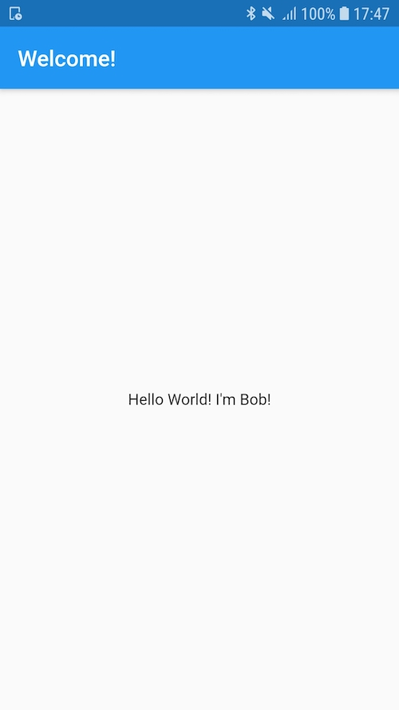

# A library to handle the configuration of translations for your app

## Configuration of the project

First, your need set the supported languages for the application, and then set the supportedLocales and the localizationsDelegates in the primary MaterialApp of your application.

```dart
void main() {
  runApp(MyApp());
}

class MyApp extends StatefulWidget {
  @override
  _MyAppState createState() => _MyAppState();
}

class _MyAppState extends State<MyApp> {
  @override
  void initState() {
    super.initState();

    TranslationsSupport().supportedLanguages = ['en', 'fr'];
  }

  @override
  Widget build(BuildContext context) {
    return MaterialApp(
      title: 'Translations Demo',
      localizationsDelegates: [
        const TranslationsDelegate(),
      ],
      supportedLocales: TranslationsSupport().supportedLocales,
      home: MyHomePage(),
    );
  }
}
```

By default, the path to find the translations file is `your_project/assets/locale/xx.json`, xx being the name of the language (en, fr, ...). You can change the path with the `TranslationsSupport().translationFilePath` variable.

## The translations file

The plugin use JSON files for the translations. It needs to be a one-level json file.

```json
{
  "title": "Welcome!",
  "hello_world": "Hello World! I'm %s!"
}
```

## How to translate a value
The method to call is `valueOf`. The method takes two arguments. The first one is the key

```dart
class MyHomePage extends StatefulWidget {
  @override
  _MyHomePageState createState() => _MyHomePageState();
}

class _MyHomePageState extends State<MyHomePage> {
  @override
  Widget build(BuildContext context) {
    return Scaffold(
      appBar: AppBar(
        title: Text(Translations.of(context).valueOf('title')),
      ),
      body: Center(
        child: Text(
          Translations.of(context).valueOf('hello_world', args: ['Bob']),
        ),
      ),
    );
  }
}
```

## Final render

